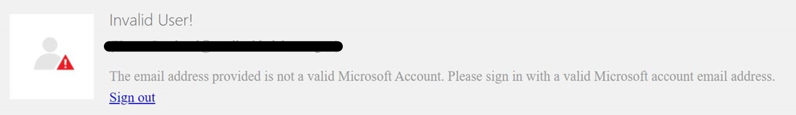
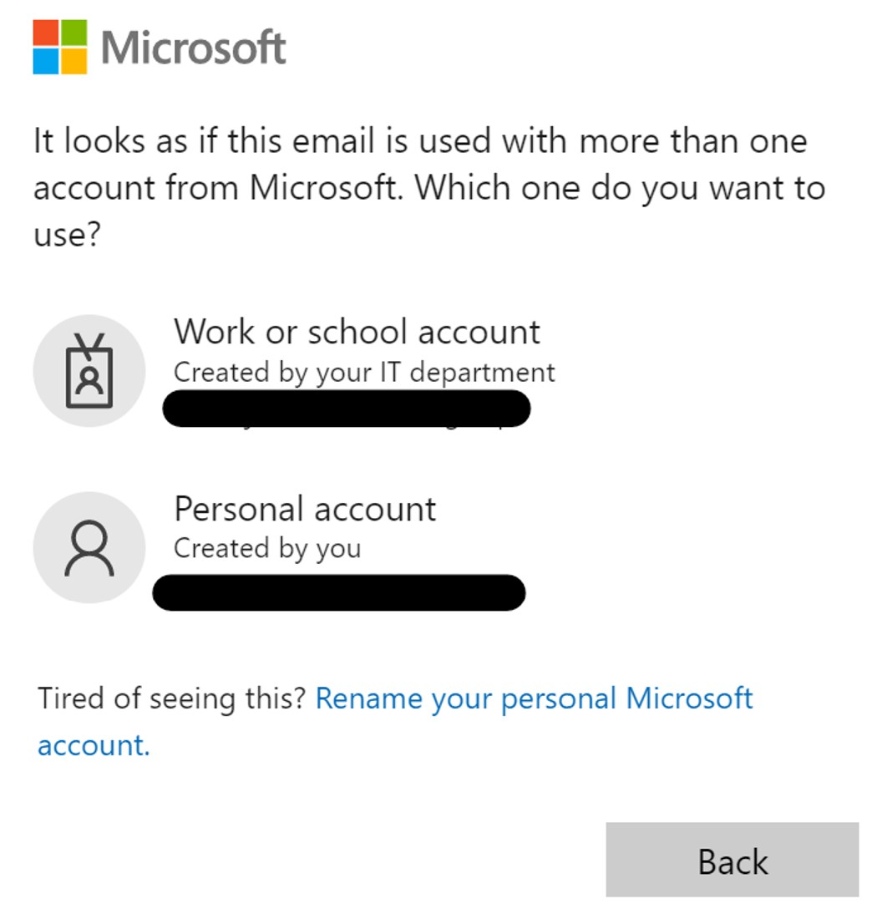
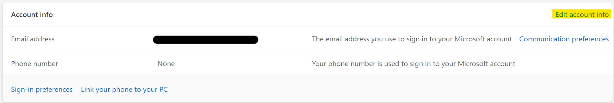
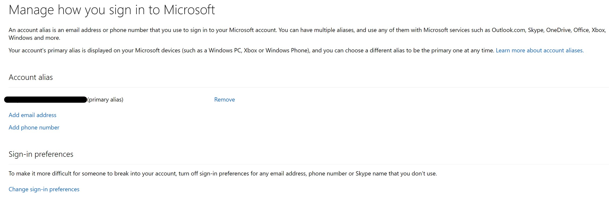

## Troubleshooting EA portal invalid user error

This document includes basic troubleshooting steps that can be performed by customer to fix ***invalid user*** error before engaging Microsoft support.
 

---
### Table of Content

 --- 
- [Troubleshooting steps](#troubleshooting-steps)

	- [user account added with wrong authentication type](#user-account-added-with-wrong-authentication-type)
	- [Unable to access personal account in InPrivate session](#unable-to-access-personal-account-in-inprivate-session)
- [Next steps](#next-steps) 

### Troubleshooting steps

One of the most common reasons why a customer is unable to access EA portal is that the user might have same ***Microsoft account*** (personal account) as ***Work or school account***. In this scenario, below are the recommended steps to be followed,

1. Determine the way account is set-up in EA portal. In general, account will be set-up in EA portal either as work or school account or as Microsoft account. 	      This can be confirmed by EA administrator. 
2. Upon confirming the account type, clear browser cache and open an in-private (incognito) browser and try to access [enterprise portal](https://ea.azure.com/).
3. In case if same account is set-up as both Work or school account and Microsoft account, ensure to choose the correct account type.  
	-Choose ***Work or school account*** in case if the account is added as work or school account in enerprise portal. 
	-Choose ***Personal account*** in case if the account is added as Microsoft account in EA portal. 
	
Below is a reference screenshot.

Choosing correct authentication type when logging into EA portal by following the troubleshooting steps often will fix the issue. However, below are the two possible challenges that an user can encounter when trying to follow the troubleshooting steps. 

### User account added with wrong authentication type

Consider user is account owner for a subscription in an EA enrolment and is unable to access the EA portal. Check with the EA admin if the account was added correctly with correct authentication type. If the user who is unable to access the EA portal is EA admin, reach out to another EA admin to add the correct account if user is the only EA admin support can make the changes on behalf of user.

### Unable to access Personal account in InPrivate session

In general, EA portal only accepts account with primary aliases. Consider customer account is added as Microsoft account in EA portal and when user is trying to perform step 3, if Personal account option is failing in *InPrivate* session, please follow the below steps:

1.	Confirm if user has access to https://account.live.com with the chosen Personal Account.
2.	In case of multiple Microsoft accounts, ensure to have the account in EA portal added as primary alias by following the below steps:  
	- Login to https://account.live.com  and select ***Your Info*** tab and click on ***Edit account info*** as highlighted below

	- Update the account added in the EA portal as primary alias as shown below

	- Confirm if you can now access the EA Portal.
	
### Next steps 

- Collect browser network trace by following the steps given in [this](https://nam02.safelinks.protection.outlook.com/?url=https%3A%2F%2Fdocs.microsoft.com%2Fen-us%2Fazure%2Fazure-portal%2Fcapture-browser-trace&data=04%7C01%7Cdkrishnaveni%40microsoftsupport.com%7C3b82329f6b9b4ae019f608da03672bd6%7Cb4c546a47dac46a6a7dded822a11efd3%7C0%7C0%7C637826038903625296%7CUnknown%7CTWFpbGZsb3d8eyJWIjoiMC4wLjAwMDAiLCJQIjoiV2luMzIiLCJBTiI6Ik1haWwiLCJXVCI6Mn0%3D%7C3000&sdata=QB1wwYhFZHKRFBE%2BEyfmNN6JTfw0uzYXcp1%2BV87GlSU%3D&reserved=0) document.

- Engage Microsoft support team by [creating an azure support request](https://docs.microsoft.com/en-us/azure/azure-portal/supportability/how-to-create-azure-support-request) for further assistance.
